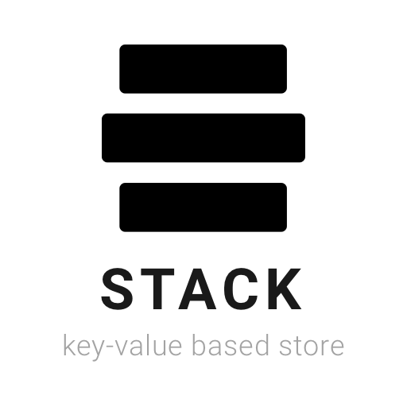

<div align="center">


</div>

<p align="center">A key-value based store for notes.</p>

<div align="center">

[](http://forthebadge.com) [](http://forthebadge.com) [](http://forthebadge.com) [](http://forthebadge.com)
</div>

<div align="center">

[](https://github.com/standard/standard)
</div>

For more details, head to: [https://stack-writer.com](http://stack-writer.com).
The project structure is based on [electron-vue](https://github.com/SimulatedGREG/electron-vue).

Currently, under heavy development.

> Core of the key-value based note store

## Introduction

What is Stack?
Stack is a core package which enables you to use a key-value based store api for taking notes.

## Install

```bash
npm install --save stack-io
```

## Usage

```javascript

import stack from 'stack-io'

// add a note
stack(note: string, )
stack.add(note: string)

// remove note
stack.remove(noteId: string)

stack.keys()
stack.values()

stack.search()


```

## Contribute

1. [Fork](https://help.github.com/articles/fork-a-repo/) this repository to your own GitHub account and then clone it to your local device
2. Install the dependencies: `npm install`
3. Build the code and watch for changes: `npm run dev`
4. Lint your code: `npm run lint`
5. Commit and push your changes to the forked repository
6. Open a pull request from the new branch to the original repo
7. Clean up after your pull request is merged
